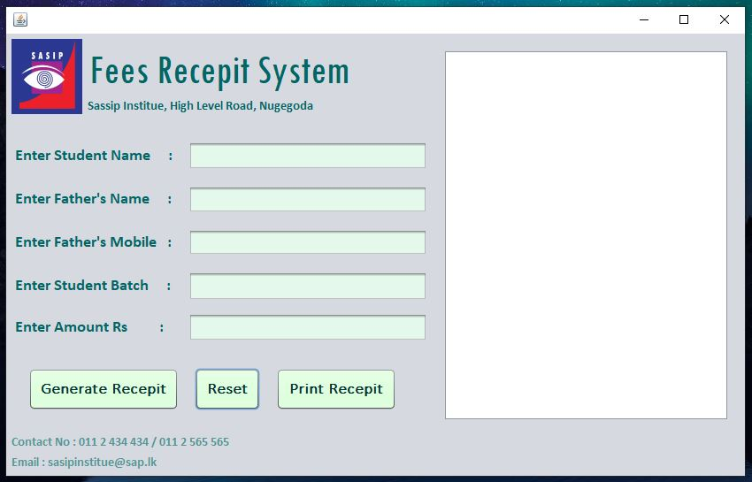
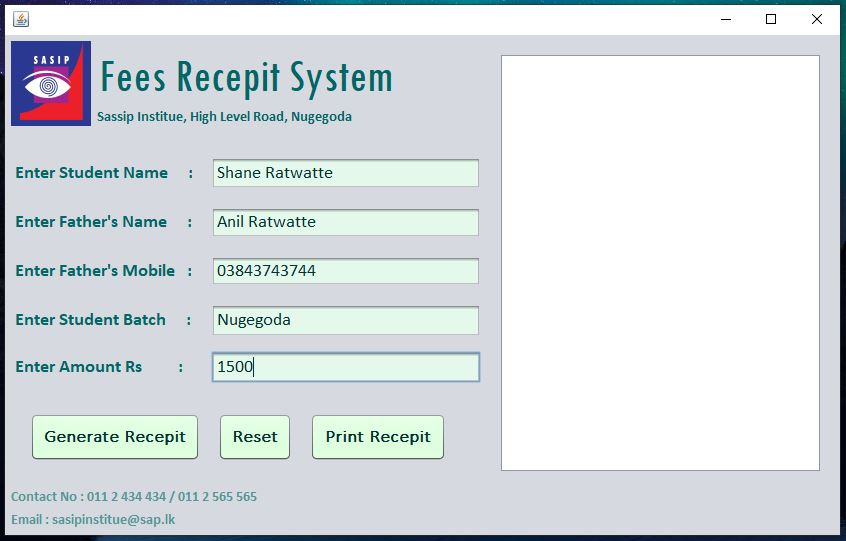
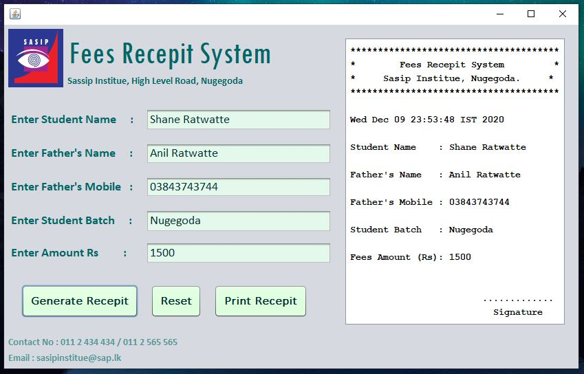
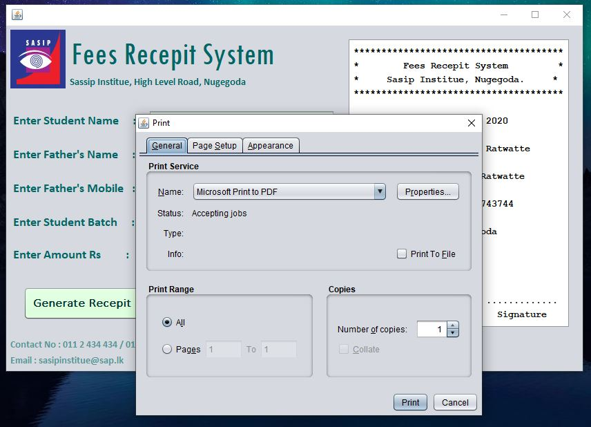
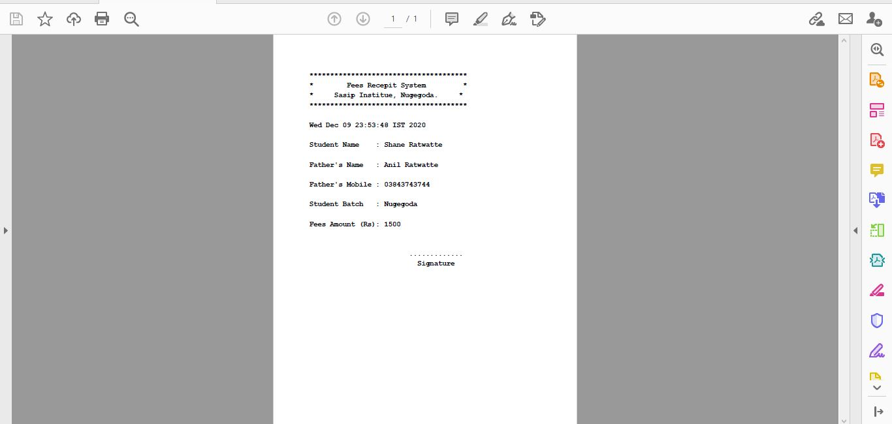

# Fees-Receipt-Bill-Print-in-Java

### Table of Content
-01 [What is this?](#What) 
-02 [For why?](#why) 
-03 [What are the technologies used?](#technologies) 
-04 [How to used this?](#How) 
-05 [Tutorial Link](#tutorial) 

## What is this?<a name="What"/>
This is simple desktop application for print Receipt Bill.  

## For why?<a name="why"/>
By using this Desktop Application you can print your own Receipt Bill. 

## What are the technologies used?<a name="technologies"/>
- JAVA
- Netbeans

## How to use this?<a name="How"/>
- First of all launch the application.

- After that fill the details in the form. 
 

- If you click the **Generate Receipt** button you can see the bill that you goint to print. 
 

- If you click the **Reset** button reset all the fields in the form. 

- If you click the **Print Receipt** button you can start print your bill. 
 

 

## Tutorial Link <a name="tutorial"/>
Thank you for the tutorial..!! ❤️❤️ https://www.youtube.com/watch?v=0g0uX6rhksE
